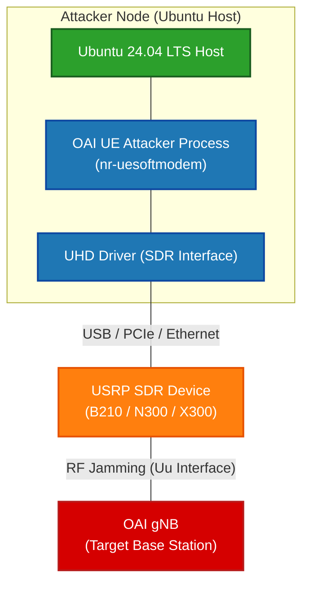

# MSG1 Jamming Attacker Manual

# Table Of Content
- [Introduction](#introduction)
- [Scenario](#scenario)
  - [Minimum hardware requirements](#minimum-hardware-requirements)
- [Step](#quick-re-buildafter-edit)
## Introduction
This document explains how to configure, build, and run the MSG1 Jamming Attacker based on OAI (OpenAirInterface).

## Scenario

### Attacker Setup Diagram



### Minimum hardware requirements 

- **Laptop for the MSG1 attacker**
    - Operating System: Ubuntu 24.04 LTS (https://releases.ubuntu.com/24.04/ubuntu-24.04.2-desktop-amd64.iso)
    - CPU: 8 cores x86_64 @ 3.5 GHz
    - RAM: 8 GB
- **Supported USRPs:** USRP B210, USRP N300, or USRP X300
    - Identify the network interface(s) where the USRP is connected and update the gNB configuration accordingly.
 

### Quick Re-build(after edit)
```
cd ~/OAI-UE-MSG1-attacker/cmake_targets/ran_build/build
sudo ninja nr-softmodem nr-uesoftmodem dfts ldpc params_libconfig
```
#### Notes on parameters
- `ninja` : Compiler tool
- `nr-softmodem` : Main code of 5G gNB in OAI   *(OAI 中 5G gNB的主程式)*
- `nr-uesoftmodem` : Main code of 5G UE in OAI   *(OAI 中 5G UE的主程式)*
- `dfts` : (Discrete Fourier Transform Spread) Module of **DFT-s-OFDM** Signal processing algorithms   *(負責訊號處理演算法)*
- `ldpc` : (Low-Density Parity-Check)Channel Coding in 5G NR, doing error correction and error detection.   *(負責在傳輸數據時進行糾錯與檢錯)*
- `params_libconfig` : Function library of OAI loading Configuration Files *(OAI 用於載入設定檔的函式庫)*


### Execute Attacker (USRP B210)

> [!IMPORTANT]
> Run the attacker on a separate host from the gNB (for example, a second Ubuntu 24.04 machine).


After building and entering the build folder, start the UE softmodem with:

```
cd richard/new/openairinterface/cmake_targets/ran_build/build
sudo ./nr-uesoftmodem -r 106 --numerology 1 --band 78 -C 3619200000 --ssb 516 -E --ue-fo-compensation
```

### Notes on parameters

- `-r 106`:Number Resource Block is 106
- `--numerology 1`: Subcarrier Spacing（SCS）。 A value of 1 indicates 30 kHz (2^1 × 15 kHz). *(子載波的間距)*
- `--band 78`: Use the **n78 (3.3-3.8 GHz)frequency band**.
- `C <frequency>`: The value passed to `C` is the center frequency in Hz, computed from the SSB ARFCN. Convert the SSB ARFCN to the corresponding frequency (Hz) and provide that value to `C`.
- `-ssb <offset>`: The value passed to `-ssb` is the SSB index/offset used to select the specific SSB within the carrier.
- `-E`: External Timing Synchronization *(時序同步)*
- `--ue-fo-compensation`: Enable automatic frequency offset compensation. *(啟用頻率偏移自動補償)*

### Available options

- `--seq <value>`: RACH amount  (max = 64)
- `--ue-max-power <value>`: UE maximumn power limination (90+)
- `-ue-txgain <value>`: Adjust UE transmit power (tx gain). Example: `-ue-txgain 120`.
- `-ue-rxgain <value>`: Adjust UE receive gain (rx gain). Example: `-ue-rxgain 120`.
- `att_tx <value>`: Adjust gNB transmit power (if supported by the attacker tool).
- `att_rx <value>`: Adjust gNB receive gain (if supported by the attacker tool).
