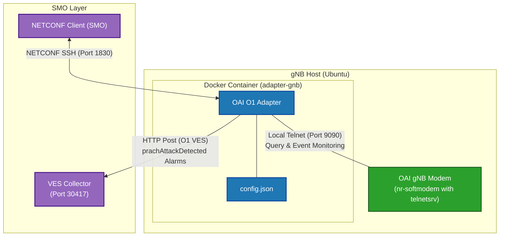

# OAI O1 Adapter Manual

## Table Of Content
- [Introduction](#introduction)
- [Scenario](#system-integration-diagram)
- [Step](#run-o1-adapter)


## Introduction
This guide covers building, configuring, and running the OAI O1 Adapter. The O1 Adapter acts as a mediator bridging the OAI gNB (using Telnet commands) with the SMO layer (via O1 interfaces such as VES Collector and NETCONF).


## System Integration Diagram




### Run O1 Adapter

```
cd o1-adapter
sudo ./start-adapter.sh --adapter
```


### Stop and Remove O1 Adapter

```
sudo docker stop adapter-gnb
sudo docker rm adapter-gnb
```
