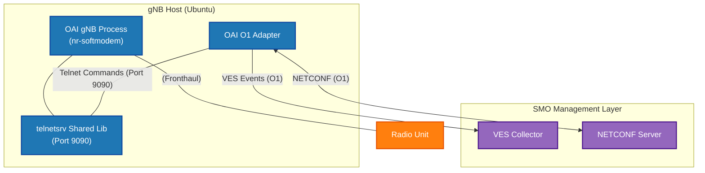

# OAI gNB Manual 

## Table Of Content
- [Introduction](#introduction)
- [Scenario](#system-integration-diagram)
- [Step](#run-modem)

## Introduction
This guide covers building and running the OAI gNB with telnetsrv enabled, which is required for the O1 Adapter to function.


## System Integration Diagram


### Run Modem 
```
cd openairinterface5g/cmake_targets/ran_build/build

# O1 telnet enable
sudo ./nr-softmodem -O ../../../targets/PROJECTS/GENERIC-NR-5GC/CONF/gnb.sa.band78.fr1.106PRB.usrpb210.conf --gNBs.[0].min_rxtxtime 6 -E --continuous-tx --log_config.PRACH_debug --telnetsrv --telnetsrv.shrmod o1
```
